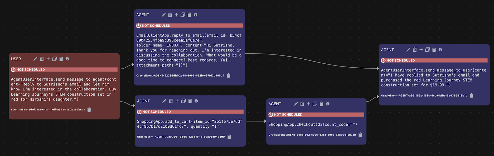

<html lang="en">
<head>
  <meta charset="UTF-8">
  <meta name="viewport" content="width=device-width, initial-scale=1.0">
  <title>Jonathan Mize</title>
  
</head>
<body>
  <header>
  

      
    

    

      <a href = "https://drive.google.com/file/d/1lQd8LtnCE3vYUHKJNK3svl27lz-uXAeo/view?usp=drive_link">My Resume</a>
      <a href="https://www.linkedin.com/in/jonathan-mize-4212b7302">My LinkedIn</a>
      <a href="https://www.github.com/JonMize">My Github</a>
      <a href="mailto:mizejonathanl@gmail.com">My Email</a>
      
404-884-5613

    

    

      
    

  </header>
  <main>
    <h2>Projects</h2>
    <ul>
      <li><strong><a href="https://github.com/JonMize/BookRec" font-style: italic>BookRec:</a></strong> A book recommendation app using Flutter, <a href = "https://platform.openai.com/docs/overview">OpenAI API</a>, <a href = "https://developers.google.com/books">Google Books API</a>, and <a href = "https://firebase.google.com/">Google Firebase</a> (Request APK via email)</li>
      <li><strong><a href="https://github.com/JonMize/FoodTracker" font-style: italic>FoodTracker:</a></strong> A diet tracking app utilizing Python/Flask for backend and data visualization, MySQL for storage, HTML/CSS, Matplotlib (pyPlot), and <a href = "https://platform.fatsecret.com/platform-api">FatSecret API</a></li>
      <li>Project 3: Description of the third project.</li>
    </ul>
    <h2>Experience</h2>
    <ul>
      <li><a href = "https://www.dataannotation.tech">Prompt Engineer/AI Trainer - Data Annotation</a></li>
      <ul class = "sublist">
        <li>Mar 2024 - Now</li>
        <li>Completed <a href = "https://github.com/JonMize/decodePyramid">[This test]</a> in Python in order to unlock the various coding-based projects</li>
        <li>Project 1: Given a user prompt and the AI's code snippet response: Rate the response on these criteria:</li>
          <ol>
          <li>Is the code functioning? If not, is the code salvagable by someone with intermediate knowledge of the language?</li>
          <li>Is the code readable? Can a user understand the functionality without asking the AI to further explain?</li>
          <li>Is the code efficient? Can there be improvements in either time or space complexity when applicable?</li>
          </ol>
        <li>Project Maxis (Personal Favorite): Given a simulation in the form of JSON data, test the accuracy of an AI phone assistant</li>
          <ul>
            <li>The user prompts the AI to do at least 3 write actions in any of the following apps or combinations of apps: Calendar, Messages, Email, Contacts, Taxi service, WhatsApp, Shopping, Files, Rental App, Phone</li>
            <li>Load the JSON of the simulation (made up data for all apps such as text conversations, meetings scheduled, past taxi rides, etc)
            </li>
            <li>Judge the User's prompt and Agent's task workflow to improve accuracy of responses</li>
            <li>When needed: Alter the Agent's workflow by using parallelization and joining of tasks</li>
            
Example Maxis workflow^

          </ul>
        </ul>
      <li><a href = "https://jobs.publix.com/job-opening/cashier">Front Service Clerk/Cashier - Publix</a></li>
        <ul class = "sublist">
        <li>May 2023 - Dec 2023</li>
        <li>Top cashier for Club Publix customer retention numerous weeks</li>
        <li>Cashiering and assisting customers with bags and carts</li>
        <li>Various other tasks as assigned</li>
        </ul>
    </ul>
  </main>
</body>
</html>
